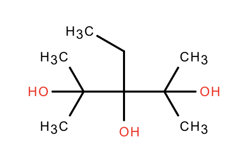

## Problems to solve:

### Visual detection of chemical graph

How to detect molecule based on it's graph or visual representation

Imagine you have a picture like this:

### IUPAC name to structure and structure to name

How to detect molecule based on it's IUPAC name and convert it

Imagine you have a name like this:

`3-Ethyl-2,4-dimethylpentane-2,3,4-triol` and you convert it to graph representation like this:

Also, you would need to have ability to convert structure back to IUPAC name as well

